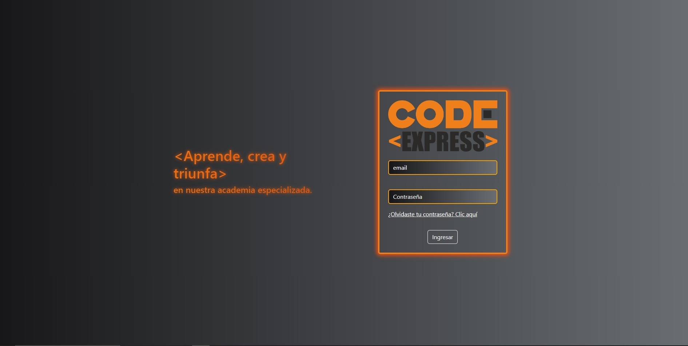
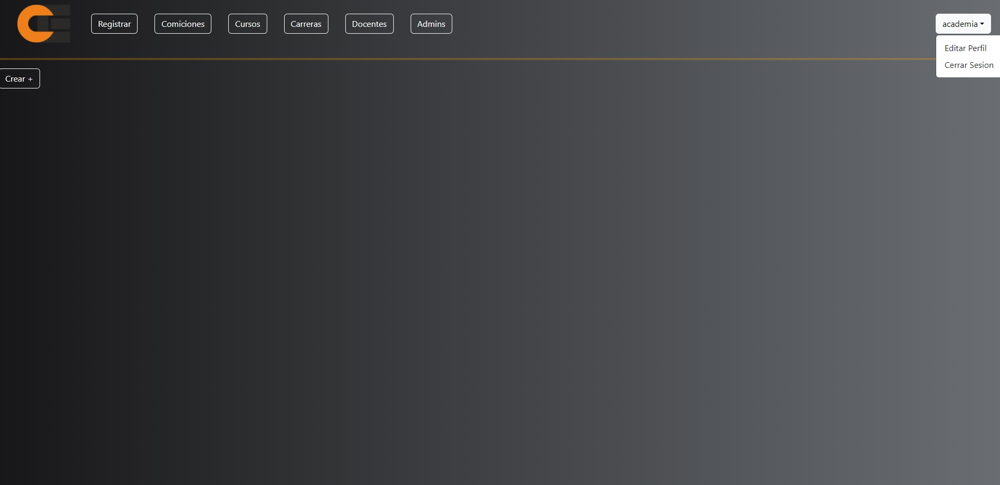
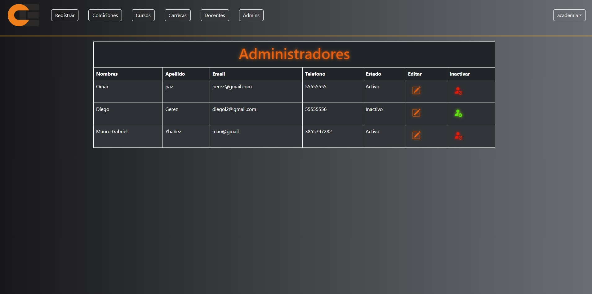
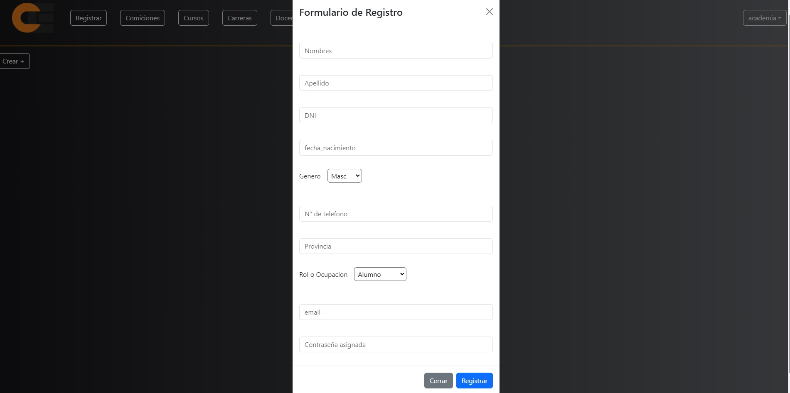
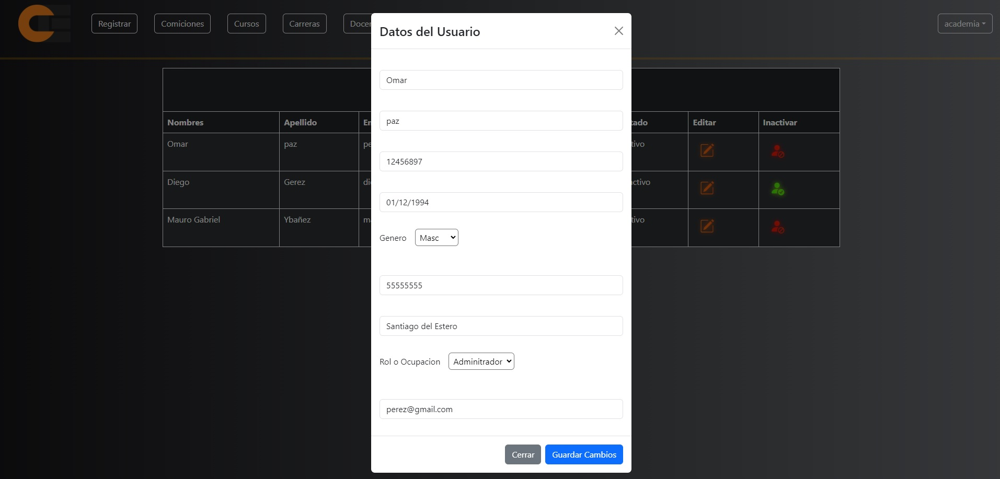
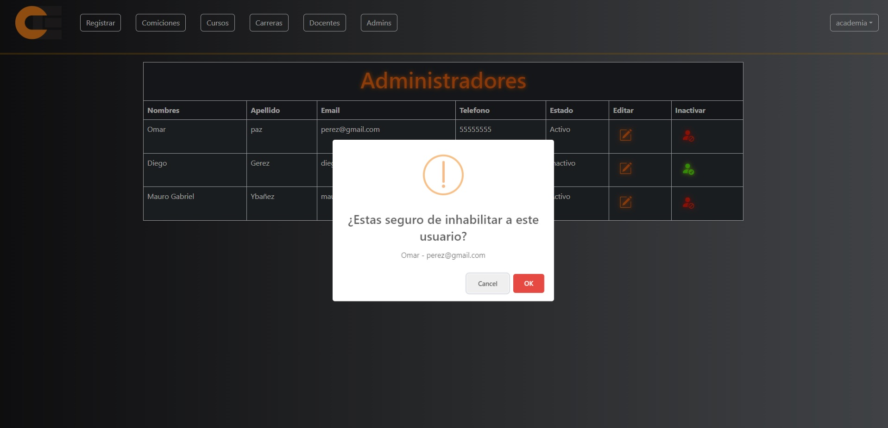
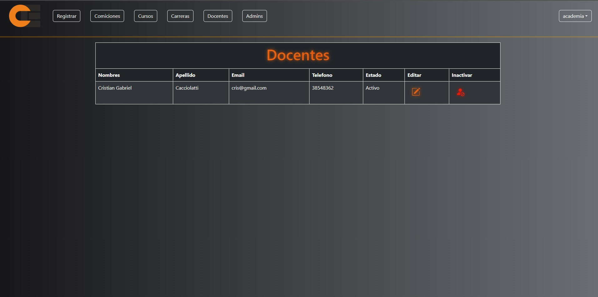
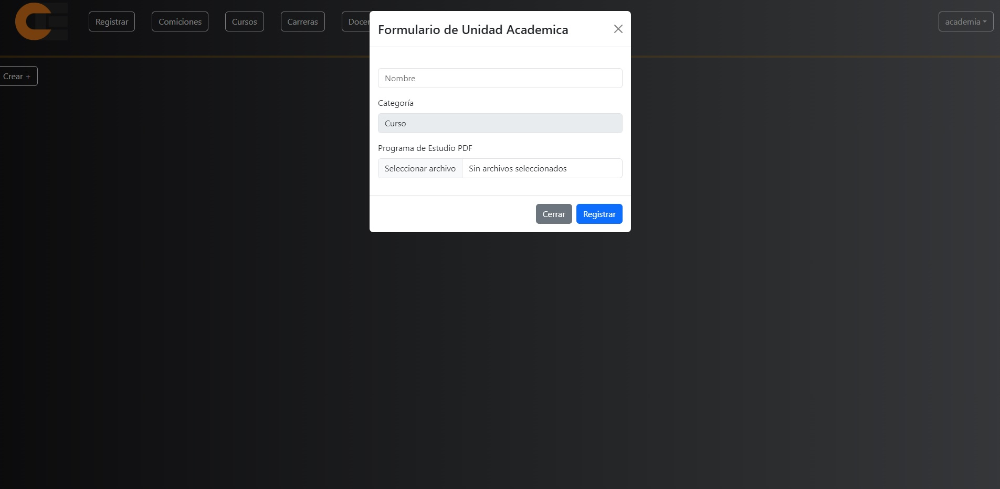

# CodeExpress  - SPA (Deployado y Responsivo)

  

  

  

  

  

  

  

  

  

► Deploy Frontend: AUN NO SE DEPLOYO SIGUE EN DESARROLLO!

Tecnologías necesarias:
* React
* Vite
* Node
* Express
* axios
* MongoDB
* mongoose

IMPORTANTE: Se utilizo Bootstrap, react-bootstrap, sweetalert y sus correspondientes estilos, ademas de CSS puro.

# Descripción
Esta es una aplicacion, aun en desarrollo de una plataforma para una academia online
esta desarrollada en su mayoria la parte administrativa, tanto como las funciones de registrar alumnos o profesores
como la de crear unidades academicas (carreras/cursos) esta tambien proyectada a tener comisiones para los alumnos y 
las respectivas actividades que estos van a realizar mediante la plataforma, aportandole el material educativo!

* Iniciar sesion/Login donde alumnos, profesores y administradores puede autenticarse
* Registro donde se puede dar de alta a alumnos, profesores, administradores
* Pagina de menu para administradores, con cards de las comisiones de alumnos, cursos , carreras, docentes, admins, registrar y perfil
* Tabla de administradores, con opciones para editar, inhabilitar y habilitar a los administradores y sus datos 
* Tabla de docentes, con opciones para editar, inhabilitar y habilitar a los docentes y sus datos 
* Tabla de alumnos, con opciones para editar, inhabilitar y habilitar a los alumnos y sus datos (en desarrollo)
* Formulario de unidad academica crea una carrera o curso subiendo el programa en formato pdf

#### Frontend

Aplicación de React
__Pagina inicial__: 
Landing page con:
- [ ] Login donde se ingresan los siguientes datos:
     * Email
     * Contraseña
- [ ] Restablecer contraseña envia un email al correo por si se olvida la contraseña y desea restablecerla mediante el uso de emailjs
- [ ] Animacion con fraces motivacional para los estudiantes que cambian al actualizar 

     
__Pagina Menu De Academia__:
- [ ] Barra de navegacion con los siguientes botones:
     * Perfil de usuario
     * Registrar
     * Comiciones
     * Cursos
     * Carreras
     * Docentes
     * Admins

- [ ] Formulario para alta de usuario con los siguientes datos:
       
     * Nombre
     * Apellido
     * DNI
     * Fecha de nacimiento
     * Genero
     * Numero de telefono
     * Provincia
     * Rol o ocupacion
     * Correo electronico
     * Contraseña asignada     
     
- [ ] Tabla de administradores que lista a todos los administradores de la plataforma con los datos:
     * Nombre
     * Apellido
     * Email
     * Telefono
     * Estado
     * Opcion de editar
     * Opcion de inhabilitar usuario
     * Opcion para habilitar usuario

- [ ] Tabla de docentes que lista a todos los administradores de la plataforma con los datos:
     * Nombre
     * Apellido
     * Email
     * Telefono
     * Estado
     * Opcion de editar
     * Opcion de inhabilitar usuario
     * Opcion para habilitar usuario

- [ ] Formulario para crear un curso o carrera con los siguientes datos:
       
     * Nombre
     * Categoria
     * Programa de estudio en pdf

 IMPORTANTE: Esta aplicacion aun se encuentra en face de desarrollo!  